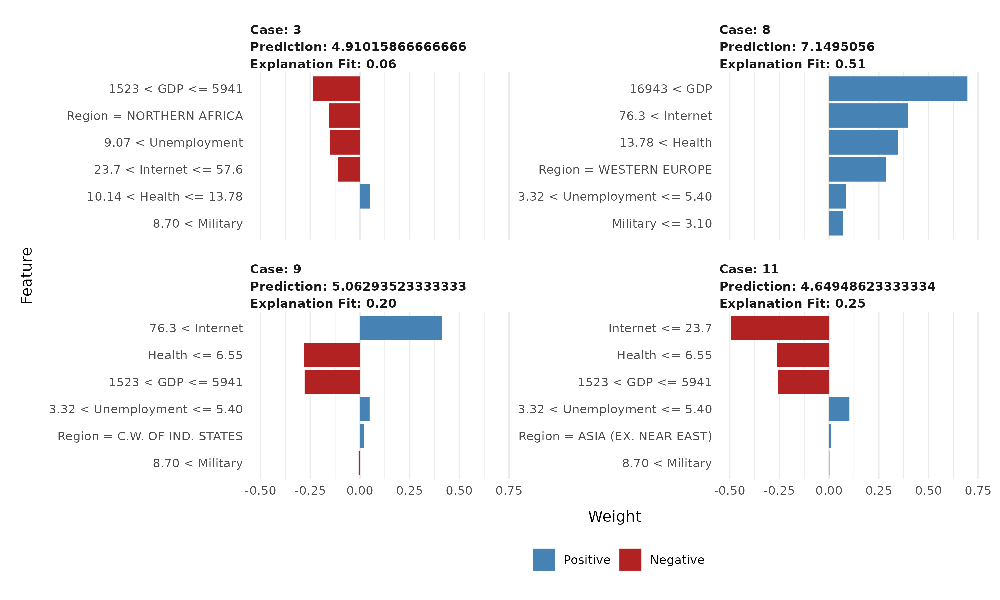

```{r setup, include=FALSE}
knitr::opts_chunk$set(echo=FALSE, message=FALSE, warning=FALSE, fig.height=4, fig.width=10, fig.align='center')
```


```{r}
# Load packages
library(tidyverse)
library(readr)
library(knitr)
library(ggplot2)
library(dplyr)
library(maps)
library(Lock5Data)
library(gridExtra)
library(lme4)
library(lmerTest)
library(Matrix)
library(lime) # import LIME package
library(caret)
library(yardstick) # for calculating RMSE
```

## Abstract 

This paper investigates the relationship between a country’s happiness score, economic wealth, and resource allocation, using data on 137 countries from 2018. Using a mixed-effects model, random forest variable importance measures, and a local variable importance measure, we analyze the impact of factors such as GDP, internet access, healthcare and military expenditures, and unemployment rates on societal well-being. While GDP emerges as a significant predictor of happiness scores, our findings also reveal limitations in variable importance rankings, particularly concerning the overemphasis of correlated features. Despite efforts to address this issue, such as conditional variable importance (CI), challenges persist in adapting machine learning techniques like random forests to multilevel data structures. Future research could focus on developing methodologies to overcome these challenges and improve the accuracy of variable importance assessments. By gaining insights into the factors influencing societal well-being, we aim to pave the way for more effective policy interventions geared towards fostering enhanced happiness and overall quality of life worldwide.

\newpage

### Introduction

Over the past decade, there has been considerable growth in the empirical investigation of subjective well-being, commonly referred to as happiness or satisfaction (Diener et al., 2018). Previous studies have explored the various levels of happiness observed across different countries, as well as the impact of economic factors, including income levels and economic development (Schyns, 1998). Schyns found a strong and positive correlation between happiness and economic prosperity. In this study, we analyze a dataset from 2018 with information on 137 countries, with happiness score serving as our main response variable. We aim to understand not only how a country’s economic prosperity, as indicated by Gross Domestic Product (GDP) per capita, shapes the quality of life of its citizens, but also how the allocation of resources, including but not limited to government expenditures directed towards healthcare and the military, influences societal well-being.

Therefore, this report aims to address the following research question: How does a country’s happiness score vary in relation to its economic wealth and available resources? We expect countries with higher GDPs to exhibit higher happiness scores. Using a mixed-effects model, we will examine how happiness scores of different countries relate to GDP and available resources. Furthermore, we will examine and compare various methodologies for measuring variable importance in an attempt to determine the most significant factors influencing a country’s happiness score.

Through an exploration of the relationship between economic prosperity, resource allocation, and subjective well-being, our goal is to contribute to the advancement of happiness economics. Additionally, we seek to offer evidence-informed insights that can guide policy interventions designed to promote greater societal well-being.
 
### Data  

The data in this research involved the merging of three datasets, each contributing valuable information to our analysis. The first dataset, the 2018 World Happiness Report obtained from Kaggle, serves as a foundational source of data on subjective well-being (Pramanick, 2018). Based on the Gallup World Poll conducted by Gallup, Inc., the report provides a comprehensive assessment of happiness levels across countries and regions. From this dataset, the variables of interest are the countries or regions themselves ('Country_or_region') and our response variable, 'Happiness_score.' Happiness scores were derived from the Cantril ladder scale, a measure in happiness research which involves asking individuals to rate their current life satisfaction on a scale from 0 to 10, with 0 representing the worst possible life and 10 representing the best possible life. 

The second dataset is the *AllCountries* dataset sourced from the ‘Lock5Data’ package in R (Lock, 2021), which has data on the countries of the world collected for 2018 or the most recently available year. The data was gathered online from the World Bank (World Bank, n.d.). The variables of interest extracted from this dataset are 'GDP' (Gross Domestic Product per capita in US dollars), 'Military' (percentage of government expenditures directed toward the military), 'Health' (percentage of government expenditures directed toward healthcare), 'Internet' (percentage of the population with access to the internet), and 'Unemployment' (percent of labor force unemployed). These variables were chosen because they represent fundamental aspects of a country's economic well-being and societal infrastructure.

Finally, the third dataset used is the Countries of the World dataset, also obtained from Kaggle and comprising data from the US government (Lasso, 2018). This dataset links country names to their respective regions across the globe, thus allowing us to incorporate regional differences into our analysis, acknowledging that cultural, political, and geographical factors may also influence happiness levels. The dataset encompasses 11 distinct regions, namely: Asia (excluding Near East), Baltics, Commonwealth of Independent States, Eastern Europe, Latin America & Caribbean, Near East, Northern Africa, Northern America, Oceania, Sub-Saharan Africa, and Western Europe.

Merging the 2018 World Happiness Report first with the *AllCountries* dataset, and then with the Countries of the World dataset, resulted in a dataframe containing data on happiness scores from 137 countries. This count reflects the number of countries with available happiness scores for the year 2018. Thus, in total there are 137 observations and 8 variables, as we are exclusively examining data from 2018. Note that 6 countries in our final merged dataframe had missing values for 'Region.' To address this, we manually assigned them to the region that appeared most appropriate among the 11 regions in the Countries of the World dataset. Specifically, we assigned Bosnia and Herzegovina, Kosovo, and Montenegro to Eastern Europe, the Central African Republic and South Sudan to Sub-Saharan Africa, and Myanmar to Asia. Table 1 presents the first five rows of the data and the main variables important to this research, and Table 2 shows summary statistics for the numerical variables in our dataset. The mean happiness score is 5.42 and the mean GDP per capita is $15,980.

```{r, include = FALSE, fig.width = 20}
#setwd("/cloud/project/data")
happy <- read_csv("hapiscore2018.csv") # only want to look at happiness scores for 2018 since the other dataset I will work with contains data from 2018

data("AllCountries")

### DATA CLEANING - World Happiness Report 2018 ### 

summary(happy)
happy[sapply(happy, is.character)] <- lapply(happy[sapply(happy, is.character)], as.factor) # convert all character variables to factor
happy$`Perceptions of corruption` <- as.numeric(as.character(happy$`Perceptions of corruption`)) # convert perceptions of corruption to numeric
glimpse(happy)
colnames(happy) <- gsub(" ", "_", colnames(happy)) # replace all spaces in column names with underscores
n_distinct(happy$Country_or_region) # 156 different countries or regions

### DATA CLEANING - AllCountries (data for each variable were collected for 2018 (or most recently available year) ###

summary(AllCountries)
n_distinct(AllCountries$Country) # 217 different countries in this dataset, I will only look at the places that also have a happiness score in the other dataset

### CREATING A MERGED DATASET 

# Merge two datasets
countries_with_happy <- merge(happy, AllCountries, by.x = "Country_or_region", by.y = "Country") 

# Call column '2018' 'Happiness_score'
colnames(countries_with_happy)[colnames(countries_with_happy) == "Score"] <- "Happiness_score" 

summary(countries_with_happy)
glimpse(countries_with_happy)
n_distinct(countries_with_happy$Country_or_region) # 137 countries in final dataset

# Selecting a subset of the data
countries_with_happy <- countries_with_happy[, c("Happiness_score", "Country_or_region", "GDP", "Military", "Health", "Internet", "Unemployment")]

# adding a 'Region' column
regions <- read_csv("countriesregions.csv") # from: https://www.kaggle.com/datasets/fernandol/countries-of-the-world

countries_with_happy <- left_join(countries_with_happy, regions, by = c("Country_or_region" = "Country"))
countries_with_happy <-  countries_with_happy[, c("Happiness_score", "Country_or_region", "GDP", "Military", "Health", "Internet", "Unemployment", "Region")]

# create a table of only the countries with missing values for 'Region' 
countries_with_missing_region <- countries_with_happy %>% filter(is.na(Region))

# print countries with missing values for 'Region'
print(countries_with_missing_region)

# eliminate missing values in 'Region' col by sorting places with NA for 'Region' into one of the 11 regions
countries_with_happy <- countries_with_happy %>%
  mutate(Region = ifelse(Country_or_region %in% c('Bosnia and Herzegovina', 'Kosovo', 'Montenegro'), 'EASTERN EUROPE', ifelse(Country_or_region %in% c('Central African Republic', 'South Sudan'), 'SUB-SAHARAN AFRICA', ifelse(Country_or_region == 'Myanmar', 'ASIA (EX. NEAR EAST)', Region))))
```

```{r}
# Create a table for the first 5 rows of our final dataset
T1 <- head(countries_with_happy, n = 5)
kable(T1, col.names = c("Happiness Score", "Country/Region", "GDP", "Military", "Health", "Internet", "Umemployment", "Region"), digits = 2, caption = "First 5 Rows of the Dataset")
```

```{r}
# Create a summary statistics table including # of NAs (this will be table 2)

library(summarytools) # has the descr function

# Calculate summary statistics
descr <- descr(countries_with_happy, stats = c("mean", "sd", "min", "q1", "med", "q3", "max")) # the descr() func calculates summary statistics for numerical data

# Convert the summary statistics object to a data frame
descr_df <- as.data.frame.matrix(descr)

# Calculate number of missing values per variable
missing_values <- sapply(countries_with_happy, function(x) sum(is.na(x)))

# Add a row for missing values to the summary statistics data frame
descr_df <- rbind(descr_df, missing_values)

# Add row name for missing values row
rownames(descr_df)[nrow(descr_df)] <- "NA Count"

# Specify digits argument for each column
digits <- c(2, 2, 2, 2, 2, 2, 2, 0) # 2 decimal places for all columns except the last one which will have 0 decimal places

# Print as kable table with specified digits
kable(descr_df, col.names = c("GDP", "Happiness Score", "Health", "Internet", "Military", "Unemployment"), caption = "Summary Statistics", digits = digits)
```

### Methods  

We aim to explore how a country’s happiness score varies in relation to its economic wealth and available resources. Furthermore, we intend to compare the rankings of feature importance across various variable importance measures.

We started off our model-building process with an Ordinary Least Squares (OLS) regression model. Since we are interested in how happiness scores vary with economic wealth, we included GDP per capita in US dollars as an explanatory variable. 

```{r, fig.cap = "Scatterplot of GDP Versus Happiness Score"}
# Scatterplot of happiness score VS GDP per capita
ggplot(data=countries_with_happy, aes(x=GDP, y=Happiness_score)) + 
  geom_point() +
# geom_text(aes(label = Country_or_region), hjust = 0.5, vjust = -0.5) + # in case I ever want to see the country each pt represents. Costa Rica has low GDP but high happiness!
  ylab("Happiness Score (0-10)") + 
  xlab("GDP per capita") 
```

\newpage

Figure 1 shows a scatterplot of happiness score versus GDP, and while overall there is an upward trend, indicating that on average countries with higher GDPs tend to have higher happiness scores, there is some right-skewness in the plot. Thus, we applied a log transformation on GDP. We also included percentage of government expenditures directed toward the military, percentage of government expenditures directed toward healthcare, percentage of the population with access to the internet, and percent of the labor force unemployed in the OLS model. 

```{r, fig.cap = "Correlation Plot for Numerical Variables", fig.align = "center"}
library(corrplot)

# Correlation plot for numerical variables in the dataset:
Corr <- cor(select_if(countries_with_happy, is.numeric), use = "complete.obs")
corrplot(Corr, type = 'upper', tl.col = "black", tl.srt = 45) # lower rectangular, tl.srt = 45 rotates the text 45 deg
```

Figure 2 depicts a correlation plot of the numerical variables in our dataset. Positive correlations are visualized in blue and negative correlations are visualized in red, with color intensity and circle size proportional to the correlation coefficients. We observe that happiness score exhibits a relatively strong positive correlation with GDP, percentage of government expenditures allocated towards healthcare, and percentage of the population with access to the internet. Happiness score has a weaker negative correlation with percentage of government expenditures directed towards the military and percentage of the labor force unemployed. Despite this, we wanted to learn more about the relationship between these variables and a country's level of happiness. GDP and percentage of the population with access to the internet are fairly highly correlated ($r$ = 0.713). Notably, the inclusion of internet in the model did not significantly increase the standard error of the coefficient estimate for log(GDP), so we went ahead and kept both log(GDP) and percentage of population with access to the internet in our OLS model. Model 1 below is the equation used to calculate the OLS regression coefficients. $Y_{ij}$ denotes the happiness score of country $j$ in region $i$, the $\beta$ terms signify the regression coefficients corresponding to each variable within the model, and $\epsilon_{ij}$ represents the error term capturing the unexplained variability in the model. 

Model 1:
$$
Y_{ij} = \beta_{0}+\beta_{1}\textrm{log(GDP)}_{ij}+\beta_{2}\textrm{Internet}_{ij}+\beta_{3}\textrm{Health}_{ij} + \beta_{4}\textrm{Military}_{ij} + \beta_{5}\textrm{Unemployment}_{ij} +\epsilon_{ij},
$$
where $\epsilon_{ij}\sim N(0,\sigma^2)$.  

Note, however, that in an OLS regression model, we assume that all entries in the data are independent and that individual countries vary from their expected happiness scores randomly, according to normal distributions with constant variance $\sigma^2$. Given that we are working with country-level data, the happiness scores of countries in the same region are likely to be more highly correlated. Figure 3 demonstrates differences in happiness scores for the different geographic regions. Given that the median happiness scores tend to vary greatly between regions, we should make sure to account for potential regional dependencies in our model.

```{r, fig.cap = "Boxplot of Happiness Scores by Region"}
library(ggplot2)  # Load ggplot2 package

# Create boxplot of happiness scores by region 
ggplot(countries_with_happy, aes(x = Region, y = Happiness_score)) + 
  geom_boxplot(fill = "skyblue", color = "black") + 
  labs(x = "Region",
       y = "Happiness Score (1-10)") +
  coord_flip() # flip the axes 
```

Linear mixed-effects models contain both fixed effects and random effects, variables that control for the random variability within each level in our model (Roback and Legler, 2021). In our case, the first level is the countries. All the variables that we included in our OLS model and will also include in our mixed-effects model are level-one variables, as they pertain to each individual country. The second level in our model will be region. We are not interested in looking at differences in happiness scores between different regions, but rather we are interested in looking at differences in happiness scores between different countries while accounting for correlation due to countries being in the same region.

We will use $\beta$ terms to represent the fixed effects, or the variables that remain constant over the countries they represent. Our mixed-effects model will include only one random effect for region, denoted $r_{i}$. Although we considered adding random slope terms, indicating that the effect of an explanatory variable such as GDP on happiness score differs between regions, a series of likelihood ratio tests, which are used to compare the fit of two nested models, consistently yielded large p-values ($p > 0.5$). This means that we do not have evidence against the null hypothesis that the model without random slopes is sufficient, suggesting that the addition of random slopes does not provide a statistically significant improvement in model fit compared to the model with only a random intercept. Consequently, Model 2 serves as our final mixed-effects model, where $i$ represents region and $j$ represents country.

Model 2:
$$
Y_{ij} = \beta_{0}+\beta_{1}\textrm{log(GDP)}_{ij}+\beta_{2}\textrm{Internet}_{ij}+\beta_{3}\textrm{Health}_{ij} + \beta_{4}\textrm{Military}_{ij} + \beta_{5}\textrm{Unemployment}_{ij} + r_{i}+\epsilon_{ij},
$$

where $r_{i}\sim N(0,\sigma_{r}^2)$ and $\epsilon_{ij}\sim N(0,\sigma^2)$.   

Here, $\sigma_{r}$ represents the standard deviation in happiness scores between regions, after accounting for fixed effects, while $\sigma$ represents the standard deviation in happiness scores between individual countries in the same region, after accounting for fixed effects. As in the OLS model, the linear mixed-effects model still includes an error term $\epsilon_{ij}$; however, in this case, the random error term pertains to differences between individual countries within the same region.

Next, we compared the rankings of feature importance across various variable importance measures to gain insights into the factors influencing countries' happiness scores. To discern potential discrepancies in how various variable importance measures perceive the relevance of economic factors and available resources, we employed random forests, a machine learning technique facilitating the assessment of variable importance. Random forests combine multiple decision trees, which serve as a nonparametric alternative to regression models and predict outcomes by repeatedly grouping similar observations in the training data. To ensure diversity among the trees, each tree in a forest is cultivated from a distinct bootstrap sample of the training data. Additionally, at each split in the tree, only a random subset of explanatory variables is considered for determining the split (Breiman, 2001). 

\newpage

A popular method for quantifying the importance of a random forest's explanatory variables is permutation variable importance (PI). To compute PI, we first construct the random forest by growing trees with bootstrap samples of the training data. The instances not used in tree construction, termed validation or out-of-bag (OOB) cases, are pivotal in our analysis. For each OOB case in every tree, we predict the response, which in our case is happiness score. In regression problems such as ours, we calculate the mean squared error (MSE), a widely used metric for assessing the performance of a regression model. MSE quantifies the average squared difference between the predicted values and the actual values of the response variable in the dataset, with a lower MSE indicating superior model performance. Next, we randomly permute or shuffle the values of a chosen explanatory variable of interest for all OOB cases in each tree and re-predict the response. We then calculate the MSE as we did for the original OOB data. The difference in predictive performance between the original and permuted data is calculated for each tree. Finally, these differences are averaged across all trees to obtain the overall variable importance score for the explanatory variable of interest. This process is repeated for all explanatory variables, enabling comparison of the different values to determine the most influential variables (Breiman, 2001). 

A large final score indicates greater importance. That is, a substantial difference between the MSEs suggests that prediction accuracy significantly decreases when the values of the explanatory variable are permuted, indicating its importance. Conversely, if the MSE remains relatively unchanged, the variable may not have a strong association with the response and thus may not be a significant predictor. In brief, in PI, if shuffling an explanatory variable leads to a large drop in prediction accuracy, then that variable is considered important. We used a for loop to generate 30 distinct PI rankings, which were then averaged to produce Table 5. 

However, a paper called “Conditional Variable Importance for Random Forests” by Strobl et al. (2008) highlights how PI can be misleading when explanatory variables are correlated with one another. Specifically, Strobl et al. discuss how PI can overemphasize the importance of correlated features. As an example of how this works, consider a scenario where we have a dataset containing information about students' high school GPA, ACT scores, and college GPA. High school GPA and ACT scores are highly correlated with one other, and we want to predict college GPA as our response variable. When we use PI and randomly permute the values of the high school GPA variable while keeping the ACT score constant, we might end up with predictions in sparse regions of the predictor space, potentially causing predictions to get much worse and resulting in a heightened importance level of the correlated variable. 

In a hypothetical case, say we have a student with a high school GPA of 4.0 and an ACT score of 30, and their predicted college GPA is 3.8 based on the original data. Now, after permuting the high school GPA values, this student's high school GPA might become 2.0 due to random permutation, but their ACT score remains 30. As a result, when we predict their college GPA using the permuted data, the prediction might be something very different from the original prediction, such as 2.5. In this scenario, the drastic change in prediction from 3.8 to 2.5 is not due to the actual impact of the high school GPA variable on college GPA, but rather due to the strong correlation between high school GPA and ACT scores.

Strobl et al. suggest an alternative approach called conditional variable importance (CI). Instead of permuting individual explanatory variables independently, CI assesses the importance of each variable while conditioning on the values of other variables. That is,  predictor variable $X_{j}$ is permuted only within groups of observations in order to preserve the correlation structure between $X_{j}$ and the other predictor variables (Strobl et al., 2008). This is supposed to help account for correlations between features and provide a more accurate assessment of each variable’s importance in predicting the response. In the scenario we described above, if we were to use CI, we would condition our analysis on individuals who scored within a particular range on the ACT in order to give us a better sense of the importance of high school GPA in predicting college GPA. We generated 30 distinct CI rankings and averaged them to produce Table 6. 

Finally, Local Interpretable Model-Agnostic Explanations (LIME) is not strictly a random forest variable importance measure, but it is a novel technique used for explaining the predictions of any machine learning model, including random forests. It provides interpretable explanations for individual predictions made by a model. The main assumption behind LIME is that every model works like a simple linear model at the local scale. That is, we can fit a simple model around a single observation and its prediction will be very close to our complex or global model.

In their 2016 paper titled “‘Why Should I Trust You?’: Explaining the Predictions of Any Classifier,” Ribeiro et al. describe how LIME works. First, the user selects an observation from the dataset for which they seek an explanation of the model’s prediction. LIME then generates perturbations of the selected observation. Perturbations are created by randomly modifying the values of the selected observation within a certain neighborhood of the original instance. The perturbed observations are passed through the black-box model, and their predictions are recorded. Next, LIME fits a local interpretable model, such as a linear model or any other model that can be easily presented to a user, to the perturbed observations and their corresponding predictions in order to approximate how the black-box model behaves locally around the selected instance. The coefficients of the local linear model represent the importance of each feature in explaining the predictions (Ribeiro et al., 2016). 

We used LIME to explain all 137 cases in our dataset, grouped by feature, then took the sum of the magnitudes of the feature weights and converted to percentages in order to get a variable importance ranking for this measure. Table 7 shows this ranking, and Figure 4 shows a LIME visualization containing individual plots for four random countries from our dataset. Note that LIME suffers from the same issue as PI: it has a tendency to artificially increase the importance of correlated features. This is due to the fact that data points are sampled from a distribution ignoring correlation between features (Molnar, 2022).

### Results  

As described in the methodology section, Model 2 (shown below) is the mixed-effects model that will be analyzed to draw our results. Table 3 displays the estimates of the fixed effects in Model 2, while Table 4 presents the estimates of the random effects.

Model 2: 
$$
Y_{ij} = [\beta_{0}+\beta_{1}\textrm{log(GDP)}_{ij}+\beta_{2}\textrm{Internet}_{ij}+\beta_{3}\textrm{Health}_{ij} + \beta_{4}\textrm{Military}_{ij} + \beta_{5}\textrm{Unemployment}_{ij}] + [r_{i}+\epsilon_{ij}]
$$

```{r}
# Create table with estimates of fixed effects from model 2
Happy_M2 <- lmer(Happiness_score ~ log(GDP) + Internet + Health + Military + Unemployment + (1 | Region), data = countries_with_happy)
kable(summary(Happy_M2)$coefficients, digits = 3, caption="Fixed Effects in Model 2")
```

```{r}
# Create random effects table for model 2
kable(VarCorr(Happy_M2), digits = 3, caption = "Random Effects in Model 2")
```

From the fixed effects estimates in Table 3, $\beta_{0}$ = 1.586 represents the estimated average happiness score when all predictor variables are zero, which includes the log transformation of GDP per capita in US dollars, percentage of government expenditures directed toward healthcare and the military, percentage of the population with access to the internet, and percent of the labor force unemployed. However, this interpretation is not applicable to any country in our dataset. There is no such country in which the log(GDP) is 0 US dollars, 0% of the population has access to the internet, 0% of government expenditures are directed towards healthcare, 0% of government expenditures are directed towards the military, and 0% of the labor force is unemployed. $\beta_{1}$ = 0.365 indicates that a one-unit increase in the log(GDP) is associated with an estimated increase of 0.365 in the happiness score after accounting for 'Internet', 'Health', 'Military', and 'Unemployment'. $\beta_{2}$ = 0.012 means that a one-percentage point increase in the percentage of the population with access to the internet corresponds to an estimated increase of 0.012 in the happiness score, adjusting for GDP, percentage of government expenditures directed toward healthcare and the military, and percentage of the labor force unemployed. $\beta_{3}$ = 0.021 indicates that a one-percentage point increase in the percentage of government expenditures directed toward healthcare is associated with an estimated increase of 0.021 in the happiness score, controlling for GDP, percentage of the population with internet access, percentage of government expenditures directed towards the military, and percentage of the population unemployed. $\beta_{4}$ = -0.002 signifies the estimated change in happiness for a one-percentage point increase in government expenditures directed towards the military, while holding all other explanatory variables constant. Finally, $\beta_{5}$ = -0.042 suggests that a one-percentage point increase in the percentage of the labor force unemployed is linked to an estimated decrease of 0.042 in the happiness score after adjusting for GDP, percentage of the population with internet access, and percentage of government expenditures directed toward healthcare and the military.

The first line in Table 4 shows us $\sigma_{r}$ = 0.266, which is the standard deviation in happiness scores between different regions, after accounting for fixed effects in the model. The second line in Table 4 shows us $\sigma$ = 0.445, which is the standard deviation in happiness scores between countries in the same region, after accounting for fixed effects. Despite the fact that there is more variability in happiness scores between countries in the same region than between regions, given the nature of our data, it is still a good idea to have region as a random effect to account for spatial correlation.

The t-values of our mixed-effects model can provide insights into the significance of the coefficients associated with each feature. The t-value measures the ratio of the estimated coefficient to its standard error. A larger t-value indicates that the estimated coefficient is more statistically significant. Interestingly, based off of the t-values in our Model 2, the variable importance ranking is: 'Unemployment', 'log(GDP)', 'Internet', 'Health', then 'Military.' The 'log(GDP)' variable is high in importance, which we will see is consistent with rankings produced by various variable importance measures, but 'Unemployment' being ranked as most important is unexpected.

Table 5, located below, displays a ranking obtained from averaging 30 PI rankings. In this ranking, 'GDP' is identified as the most important variable for predicting happiness scores, while the percentage of government expenditures directed towards the military is rated as the least important. Interestingly, the percentage of the labor force unemployed is ranked second to the bottom, which is somewhat surprising given its t-value from our mixed-effects model. 

```{r}
# Get a PI ranking, averaged over 30 runs 
set.seed(01302024)

# c <- matrix(nrow = 30, ncol = 0) # create an empty matrix
# 
# # create for loop to run 30 times
# for(i in 1:30) {
#   countries_pi <- randomForest(Happiness_score ~ ., data = countries_with_happy_imputed, ntree = 1000, importance = TRUE)
#   imp <- countries_pi$importance[,1] # store PI scores in imp
#   imp <- ifelse(imp < 0, 0, imp) # if PI score is negative, convert it to 0, else keep it the same
#   perc <- imp/sum(imp) * 100 # store PI scores as percentages in perc
#   c <- matrix(cbind(c, perc), byrow = FALSE, nrow = 6, ncol = i)
# }
# c
# 
# avg_countries_pi <- data.frame(rowMeans(c), row.names = names(perc)[]) # create df with AVERAGE PI scores as percentages
# colnames(avg_countries_pi) <- "Avg_PI_Score_As_Perc" # renaming column
# avg_countries_pi <- avg_countries_pi %>% arrange(desc(avg_countries_pi)) %>% round(digits = 2) 
# avg_countries_pi 

# save(avg_countries_pi, file = "pi_countries.Rdata")
load("pi_countries.Rdata") # USE TO LOAD IN TABLE QUICKLY IN THE FUTURE
kable(as.data.frame(avg_countries_pi), col.names = "Average Permutation Importance Score (%)", caption="Permutation Variable Importance Ranking")
```

Table 6 presents a ranking obtained by averaging 30 CI rankings. Interestingly, the order of the explanatory variables is exactly the same as it was in Table 5, which showed the average variable importance scores for PI. 'GDP' is once again ranked as most important, and 'Unemployment' is again ranked as the second least important variable.

```{r}
# Get a CI ranking, averaged over 30 runs 
library(party)
set.seed(01302024)

# d <- matrix(nrow = 30, ncol = 0) # create an empty matrix
# 
# # create for loop to run 10 times
# for(i in 1:30) {
#   countries_ci <- cforest(data = countries_with_happy_imputed, Happiness_score ~., control = cforest_unbiased(mtry = best.m, ntree = 1000))
#   cond_imp <- varimp(countries_ci, conditional = TRUE) # store conditional variable importance scores in cond_imp
#   cond_imp <- ifelse(cond_imp < 0, 0, cond_imp) # if CI score is negative, convert it to 0, else keep it the same
#   cond_imp_as_perc <- cond_imp/sum(cond_imp) * 100 
#   d <- matrix(cbind(d, cond_imp_as_perc), byrow = FALSE, nrow = 6, ncol = i)
# }
# d
# 
# avg_countries_ci <- data.frame(rowMeans(d), row.names = names(cond_imp_as_perc)[]) # create df with AVERAGE cond imp scores as %s
# colnames(avg_countries_ci) <- "Avg_Cond_VarImp_Score_As_Perc" # renaming column
# avg_countries_ci <- avg_countries_ci %>% arrange(desc(avg_countries_ci)) %>% round(digits = 2)
# avg_countries_ci 

# save(avg_countries_ci, file = "ci_countries.Rdata")
load("ci_countries.Rdata") # USE TO LOAD IN TABLE QUICKLY IN THE FUTURE
kable(as.data.frame(avg_countries_ci), col.names = "Conditional Variable Importance Score (%)", caption="Conditional Variable Importance Ranking")
```

The discrepancy between the large t-value for unemployment and its low ranking by random forest variable importance measures could be related to the difference between statistical significance and predictive power. The t-values in mixed-effects models assess the statistical significance of the relationship between predictor variables and the outcome variable within the context of the model. They indicate the strength of evidence against the null hypothesis (no effect). On the other hand, random forest variable importance measures often prioritize variables based on their predictive power rather than statistical significance. Therefore, a variable might have a low predictive importance in a random forest model but still show a statistically significant relationship with the outcome variable in a mixed-effects model.

Thus, while the large t-value for unemployment indicates that it has a statistically significant effect on happiness scores within the mixed-effects model, its low ranking by random forest variable importance measures suggests that it may not contribute substantially to predictive performance compared to other variables. 

Furthermore, it is important to note that while the random forest treats countries as independent, the linear mixed-effects model is able to capture the correlation between countries within the same region through the inclusion of a random effect for region. This may also explain the discrepancy observed between the significant t-value for unemployment and its lower ranking in the random forest analysis.

Finally, Table 7 below displays a ranking obtained by using LIME to explain all 137 cases in our dataset, grouping by feature, summing the magnitudes of the feature weights, and converting them to percentages. The LIME ranking turns out to be exactly the same as the PI and CI rankings.

```{r}
# set.seed(01302024)
# 
# library(dplyr)  # Make sure you have the dplyr package loaded
# 
# # Divide dataset into train and test
# smp_size <- floor(0.75 * nrow(countries_with_happy_imputed))
# train_index <- sample(seq_len(nrow(countries_with_happy_imputed)), size = smp_size)
# 
# train_countries <- countries_with_happy_imputed[train_index, ]
# test_countries <- countries_with_happy_imputed[-train_index, ]
# 
# cat(dim(train_countries), dim(test_countries)) # check dimensions, 102 rows in train set and 35 in test set
# 
# # Use rf model (10-fold CV repeated 5 times and a basic RF model)
# cv_specs <- trainControl(method = "repeatedcv", number = 10, repeats = 5, verboseIter = FALSE) # CV specifications
# 
# model_rf_countries <- train(x = dplyr::select(train_countries, -Happiness_score), 
#                             y = train_countries$Happiness_score, 
#                             method = "rf", 
#                             trControl = cv_specs,
#                             metric = "RMSE")
# 
# model_rf_countries # optimal mtry = 8
# 
# # Apply the predict function of this model on test set and get RMSE
# countries_rf_preds <- predict(model_rf_countries, newdata = dplyr::select(test_countries, -Happiness_score))
# # mean(test_countries$Happiness_score == countries_rf_preds) ## ??????
# 
# # Now we have our model! Use LIME to create an explainer object.
# explainer <- lime(dplyr::select(train_countries, -Happiness_score), model_rf_countries) # model_rf is the model whose output should be explained
# 
# # Explain predictions on a subset of the test set
# explanation <- test_countries %>% 
#   dplyr::select(-Happiness_score) %>%  # Remove the Happiness_score column
#  # slice(1:10) %>%
#   lime::explain(explainer = explainer, 
#                 n_labels = 1, 
#                 n_features = 6, 
#                 n_permutations = 5000, 
#                 kernel_width = 0.5)  
# 
# # Visualize this explanation
# # plot_features(explanation, ncol = 4)
# 
# # Grouping by feature, taking the sum of the abs value of feature weights, and arranging in a df sorted in order of descending feature weight: 
# total_feature_weights_countries <- explanation %>% 
#   group_by(feature) %>% 
#   summarize(total_feature_weight = sum(abs(feature_weight)),
#             total_feature_weight_as_perc = (total_feature_weight/(sum(abs(explanation$feature_weight)))* 100)) %>%
#   arrange(desc(total_feature_weight)) 
# 
# # Round the dataframe
# round_df <- function(x, digits) {
#   numeric_columns <- sapply(x, class) == 'numeric'
#   x[numeric_columns] <-  round(x[numeric_columns], digits)
#   x
# }
# 
# total_feature_weights_countries <- round_df(total_feature_weights_countries, 2)
# 
# # Save the results
# save(total_feature_weights_countries, file = "lime_countries.Rdata")

# Load the results
load("lime_countries.Rdata")

# Create a new dataframe with only 'feature' and 'total_feature_weight_as_perc' columns
total_feature_weights_as_perc_countries <- total_feature_weights_countries[, c("feature", "total_feature_weight_as_perc")]

# This dataframe contains feature names and their corresponding weights as percentages
# total_feature_weights_as_perc_countries
kable(as.data.frame(total_feature_weights_as_perc_countries), col.names = c("Feature", "Total Feature Weight (%)"), caption="LIME Variable Importance Ranking")
```

As previously discussed, both PI and LIME have a tendency to overemphasize the importance of correlated features. We noted before that GDP and percentage of the population with access to the internet are fairly highly correlated ($r$ = 0.713), and both of these variables appear at the top of our PI, CI, and LIME rankings. 'Unemployment', on the other hand, ranks near the bottom in all three of these measures, and referring back to Figure 2, demonstrates minimal correlation with other explanatory variables in our dataset. Thus, although PI, CI, and LIME yielding very similar rankings indicates a level of robustness and consistency in our estimation of variable importance, suggesting that identified important variables are more likely to have a genuine impact on the response variable, we should exercise caution in assuming that we are indeed overemphasizing the importance of certain features. 

Figure 4 depicts a LIME visualization containing individual plots for four random countries from our dataset. Case 3 represents Algeria, case 8 represents Austria, case 9 represents Azerbaijan, and case 11 represents Bangladesh. Each plot illustrates the predictions for the respective country. Features that contribute positively to the happiness score prediction are shown in blue, while features that negatively affect the happiness score prediction are shown in red. For instance, considering case 3, Algeria, an unemployment rate exceeding 9.07% has a negative effect on the happiness score prediction. Considering case 8, Austria, a GDP surpassing $16,943 has a positive effect on the happiness score prediction. The visualization also provides us with an explanation fit, which assesses how well the local interpretable model generated by LIME explains the predictions for each specific observation. The explanation fit may be quantified using a metric such as R-squared for regression problems, where a higher explanation fit signifies a better model performance. In Figure 4, case 8, Austria, has both the highest explanation fit and the highest predicted happiness score.

```{r, fig.align = 'center', fig.cap = "LIME visualization highlighting 4 random cases - case 3 represents Algeria, case 8 represents Austria, case 9 represents Azerbaijan, and case 11 represents Bangladesh.", out.width = "100%"}

```

I chose to include four plots to investigate the consistency of variable importance rankings across different countries. Across these four cases, 'GDP' consistently ranks near the top of the rankings, either coming first or third in importance. 'Military' consistently appears as the least important factor. Interestingly, 'Unemployment' exhibits some variability, ranking fourth in two cases, third in one case, and fifth in another. The fact that there are differences in the rankings across different countries reflects the nuanced and context-dependent nature of factors influencing happiness scores.

\newpage

### Conclusion

In this study, we investigated the relationship between a country's economic prosperity, resource allocation, and subjective well-being, with a focus on happiness scores derived from the "2018 World Happiness Report." Through the implementation of mixed-effects models, random forest variable importance measures, and a local variable importance measure, we aimed to understand which factors significantly impact countries’ happiness scores and how different methods perceive the relevance of these factors.

Our analysis revealed several key findings. Firstly, our mixed-effects model demonstrated that economic indicators such as GDP per capita, government expenditure on healthcare, and access to the internet are positively associated with happiness scores, while unemployment rates exhibit a negative correlation. Interestingly, while the t-values indicated the statistical significance of the unemployment coefficient, random forest variable importance measures ranked it lower in importance compared to GDP and other factors. This discrepancy suggests a nuanced relationship between statistical significance and predictive power, emphasizing the importance of considering both aspects in model interpretation.

Furthermore, our exploration of variable importance using permutation variable importance (PI), conditional variable importance (CI), and Local Interpretable Model-Agnostic Explanations (LIME) provided valuable insights into the relative importance of different features. Despite variations in methodology, these measures consistently ranked GDP as the most influential factor, highlighting its pivotal role in shaping societal well-being. They also consistently ranked the percentage of the population with access to the internet as second most important. However, given that PI and LIME are known to overemphasize the importance of correlated features and the fact that GDP and access to the internet have a correlation of 0.713, we should be careful and acknowledge that we may be overemphasizing the importance of these features. With that being said, CI supposedly addresses this issue of overemphasizing the importance of correlated features, yet its ranking is consistent with that of PI, which should give us more confidence in the reliability of our ranking.

In conclusion, our study contributes to the advancement of happiness economics by shedding light on the multifaceted determinants of subjective well-being. By combining traditional statistical approaches with machine learning techniques, we offer evidence-informed insights that can inform policy interventions aimed at promoting greater societal well-being. Future research should address the challenge of inflated importance attributed to correlated features, so that we can refine our understanding of the determinants of happiness. Moreover, incorporating multilevel structures into random forest variable importance measures remains an area for further exploration. Future research could also focus on developing methodologies to address this challenge, ensuring more robust and accurate assessments of variable importance in multilevel datasets.  

\newpage 

### References 

Breiman, L. Random Forests. Machine Learning 45, 5–32 (2001). https://doi.org/10.1023/A:1010933404324

Diener, E., Oishi, S., & Tay, L. (2018). Advances in subjective well-being research. Nature human behaviour, 2(4), 253–260. https://doi.org/10.1038/s41562-018-0307-6

Lasso, F. (2018). Countries of the World. Kaggle. Retrieved from www.kaggle.com/datasets/fernandol/countries-of-the-world.

Lock, R. (2021). Lock5Data: Datasets for "Statistics: UnLocking the Power of Data". R package version 3.0.0.
  
Molnar, C. (2022). Interpretable Machine Learning: A Guide for Making Black Box Models Explainable (2nd ed.). christophm.github.io/interpretable-ml-book/

Pramanick, S. Happiness-Index-2018. Kaggle. Retrieved from www.kaggle.com/datasets/sougatapramanick/happiness2018

Ribeiro, M. T., Singh, S., & Guestrin, C. (2016). Why should I trust you?: Explaining the predictions of any classifier. In Proceedings of the 22nd ACM SIGKDD international conference on knowledge discovery and data mining (pp. 1135-1144). ACM.

Roback, P., & Legler, J. (2021). Beyond Multiple Linear Regression: Applied Generalized Linear Models And Multilevel Models in R. CRC Press.

Schyns, P. Crossnational Differences in Happiness: Economic and Cultural Factors Explored. Social Indicators Research 43, 3–26 (1998). https://doi.org/10.1023/A:1006814424293

Strobl, C., Boulesteix, AL., Kneib, T. et al. Conditional variable importance for random forests. BMC Bioinformatics 9, 307 (2008). https://doi.org/10.1186/1471-2105-9-307

World Bank. (n.d.). Retrieved from http://data.worldbank.org/

\newpage

**Note: The source code and data for this study can be found in the Github repository: https://github.com/ninada25/AustriaSeniorExperience.git.** 
