```r
library(tidyverse)
```

```
## ── Attaching core tidyverse packages ──────────────────────── tidyverse 2.0.0 ──
## ✔ dplyr     1.1.3     ✔ readr     2.1.4
## ✔ forcats   1.0.0     ✔ stringr   1.5.0
## ✔ ggplot2   3.4.3     ✔ tibble    3.2.1
## ✔ lubridate 1.9.3     ✔ tidyr     1.3.0
## ✔ purrr     1.0.2     
## ── Conflicts ────────────────────────────────────────── tidyverse_conflicts() ──
## ✖ dplyr::filter() masks stats::filter()
## ✖ dplyr::lag()    masks stats::lag()
## ℹ Use the conflicted package (<http://conflicted.r-lib.org/>) to force all conflicts to become errors
```

```r
library(readr)
library(knitr)
library(ggplot2)
library(dplyr)
library(maps)
```

```
## 
## Attaching package: 'maps'
## 
## The following object is masked from 'package:purrr':
## 
##     map
```

```r
library(Lock5Data)
library(gridExtra)
```

```
## 
## Attaching package: 'gridExtra'
## 
## The following object is masked from 'package:dplyr':
## 
##     combine
```


```
## Rows: 156 Columns: 9
## ── Column specification ────────────────────────────────────────────────────────
## Delimiter: ","
## chr (2): Country or region, Perceptions of corruption
## dbl (7): Overall rank, Score, GDP per capita, Social support, Healthy life e...
## 
## ℹ Use `spec()` to retrieve the full column specification for this data.
## ℹ Specify the column types or set `show_col_types = FALSE` to quiet this message.
```

```
##   Overall rank    Country or region      Score       GDP per capita  
##  Min.   :  1.00   Length:156         Min.   :2.905   Min.   :0.0000  
##  1st Qu.: 39.75   Class :character   1st Qu.:4.454   1st Qu.:0.6162  
##  Median : 78.50   Mode  :character   Median :5.378   Median :0.9495  
##  Mean   : 78.50                      Mean   :5.376   Mean   :0.8914  
##  3rd Qu.:117.25                      3rd Qu.:6.168   3rd Qu.:1.1978  
##  Max.   :156.00                      Max.   :7.632   Max.   :2.0960  
##  Social support  Healthy life expectancy Freedom to make life choices
##  Min.   :0.000   Min.   :0.0000          Min.   :0.0000              
##  1st Qu.:1.067   1st Qu.:0.4223          1st Qu.:0.3560              
##  Median :1.255   Median :0.6440          Median :0.4870              
##  Mean   :1.213   Mean   :0.5973          Mean   :0.4545              
##  3rd Qu.:1.463   3rd Qu.:0.7772          3rd Qu.:0.5785              
##  Max.   :1.644   Max.   :1.0300          Max.   :0.7240              
##    Generosity     Perceptions of corruption
##  Min.   :0.0000   Length:156               
##  1st Qu.:0.1095   Class :character         
##  Median :0.1740   Mode  :character         
##  Mean   :0.1810                            
##  3rd Qu.:0.2390                            
##  Max.   :0.5980
```

```
## Rows: 156
## Columns: 9
## $ `Overall rank`                 <dbl> 1, 2, 3, 4, 5, 6, 7, 8, 9, 10, 11, 12, …
## $ `Country or region`            <fct> Finland, Norway, Denmark, Iceland, Swit…
## $ Score                          <dbl> 7.632, 7.594, 7.555, 7.495, 7.487, 7.44…
## $ `GDP per capita`               <dbl> 1.305, 1.456, 1.351, 1.343, 1.420, 1.36…
## $ `Social support`               <dbl> 1.592, 1.582, 1.590, 1.644, 1.549, 1.48…
## $ `Healthy life expectancy`      <dbl> 0.874, 0.861, 0.868, 0.914, 0.927, 0.87…
## $ `Freedom to make life choices` <dbl> 0.681, 0.686, 0.683, 0.677, 0.660, 0.63…
## $ Generosity                     <dbl> 0.202, 0.286, 0.284, 0.353, 0.256, 0.33…
## $ `Perceptions of corruption`    <dbl> 0.393, 0.340, 0.408, 0.138, 0.357, 0.29…
```

```
## [1] 156
```

```
##            Country         Code        LandArea          Population       
##  Afghanistan   :  1   ABW    :  1   Min.   :    0.01   Min.   :   0.0120  
##  Albania       :  1   AFG    :  1   1st Qu.:   10.83   1st Qu.:   0.7728  
##  Algeria       :  1   AGO    :  1   Median :   94.28   Median :   6.5725  
##  American Samoa:  1   ALB    :  1   Mean   :  608.38   Mean   :  35.0335  
##  Andorra       :  1   AND    :  1   3rd Qu.:  446.30   3rd Qu.:  25.0113  
##  Angola        :  1   ARE    :  1   Max.   :16376.87   Max.   :1392.7300  
##  (Other)       :211   (Other):211   NA's   :8          NA's   :1          
##     Density             GDP             Rural            CO2         
##  Min.   :    0.1   Min.   :   275   Min.   : 0.00   Min.   : 0.0400  
##  1st Qu.:   37.5   1st Qu.:  2032   1st Qu.:19.62   1st Qu.: 0.8575  
##  Median :   92.1   Median :  5950   Median :38.15   Median : 2.7550  
##  Mean   :  361.4   Mean   : 14733   Mean   :39.10   Mean   : 4.9780  
##  3rd Qu.:  219.8   3rd Qu.: 17298   3rd Qu.:57.83   3rd Qu.: 6.2525  
##  Max.   :20777.5   Max.   :114340   Max.   :87.00   Max.   :43.8600  
##  NA's   :8         NA's   :30       NA's   :3       NA's   :13       
##    PumpPrice         Military          Health        ArmedForces    
##  Min.   :0.1100   Min.   : 0.000   Min.   : 0.000   Min.   :   0.0  
##  1st Qu.:0.7450   1st Qu.: 3.015   1st Qu.: 6.157   1st Qu.:  12.0  
##  Median :0.9800   Median : 4.650   Median : 9.605   Median :  31.5  
##  Mean   :0.9851   Mean   : 6.178   Mean   :10.597   Mean   : 162.1  
##  3rd Qu.:1.1800   3rd Qu.: 8.445   3rd Qu.:13.713   3rd Qu.: 146.5  
##  Max.   :2.0000   Max.   :31.900   Max.   :39.460   Max.   :3031.0  
##  NA's   :50       NA's   :67       NA's   :29       NA's   :49      
##     Internet          Cell             HIV             Hunger     
##  Min.   : 1.30   Min.   : 13.70   Min.   : 0.100   Min.   : 2.50  
##  1st Qu.:29.18   1st Qu.: 83.83   1st Qu.: 0.175   1st Qu.: 2.50  
##  Median :58.35   Median :110.00   Median : 0.400   Median : 6.50  
##  Mean   :54.47   Mean   :107.05   Mean   : 1.941   Mean   :11.25  
##  3rd Qu.:78.92   3rd Qu.:127.50   3rd Qu.: 1.400   3rd Qu.:14.80  
##  Max.   :98.90   Max.   :328.80   Max.   :27.400   Max.   :61.80  
##  NA's   :13      NA's   :15       NA's   :81       NA's   :52     
##     Diabetes        BirthRate       DeathRate        ElderlyPop    
##  Min.   : 1.000   Min.   : 7.00   Min.   : 1.600   Min.   : 1.200  
##  1st Qu.: 5.350   1st Qu.:11.40   1st Qu.: 5.800   1st Qu.: 3.600  
##  Median : 7.200   Median :17.85   Median : 7.250   Median : 6.600  
##  Mean   : 8.542   Mean   :20.11   Mean   : 7.683   Mean   : 8.953  
##  3rd Qu.:10.750   3rd Qu.:27.65   3rd Qu.: 9.350   3rd Qu.:14.500  
##  Max.   :30.500   Max.   :47.80   Max.   :15.500   Max.   :27.500  
##  NA's   :10       NA's   :15      NA's   :15       NA's   :24      
##  LifeExpectancy   FemaleLabor     Unemployment        Energy     
##  Min.   :52.20   Min.   : 6.20   Min.   : 0.100   Min.   :   66  
##  1st Qu.:66.90   1st Qu.:50.15   1st Qu.: 3.400   1st Qu.:  738  
##  Median :74.30   Median :60.60   Median : 5.600   Median : 1574  
##  Mean   :72.46   Mean   :57.95   Mean   : 7.255   Mean   : 2664  
##  3rd Qu.:77.70   3rd Qu.:69.25   3rd Qu.: 9.400   3rd Qu.: 3060  
##  Max.   :84.70   Max.   :85.80   Max.   :30.200   Max.   :17923  
##  NA's   :18      NA's   :30      NA's   :30       NA's   :82     
##   Electricity      Developed   
##  Min.   :   39   Min.   :1.00  
##  1st Qu.:  904   1st Qu.:1.00  
##  Median : 2620   Median :2.00  
##  Mean   : 4270   Mean   :1.81  
##  3rd Qu.: 5600   3rd Qu.:3.00  
##  Max.   :53832   Max.   :3.00  
##  NA's   :76      NA's   :75
```

```
## [1] 217
```

```
##    Country_or_region  Overall_rank    Happiness_score GDP_per_capita  
##  Afghanistan:  1     Min.   :  1.00   Min.   :2.905   Min.   :0.0000  
##  Albania    :  1     1st Qu.: 36.00   1st Qu.:4.447   1st Qu.:0.6050  
##  Algeria    :  1     Median : 75.00   Median :5.472   Median :0.9400  
##  Angola     :  1     Mean   : 76.74   Mean   :5.423   Mean   :0.8905  
##  Argentina  :  1     3rd Qu.:118.00   3rd Qu.:6.310   3rd Qu.:1.1880  
##  Armenia    :  1     Max.   :156.00   Max.   :7.632   Max.   :2.0960  
##  (Other)    :131                                                      
##  Social_support  Healthy_life_expectancy Freedom_to_make_life_choices
##  Min.   :0.000   Min.   :0.0000          Min.   :0.0000              
##  1st Qu.:1.088   1st Qu.:0.4170          1st Qu.:0.3670              
##  Median :1.268   Median :0.6660          Median :0.5030              
##  Mean   :1.220   Mean   :0.5968          Mean   :0.4638              
##  3rd Qu.:1.466   3rd Qu.:0.7810          3rd Qu.:0.5840              
##  Max.   :1.644   Max.   :1.0080          Max.   :0.7240              
##                                                                      
##    Generosity     Perceptions_of_corruption      Code        LandArea      
##  Min.   :0.0000   Min.   :0.00000           AFG    :  1   Min.   :   0.32  
##  1st Qu.:0.1110   1st Qu.:0.05075           AGO    :  1   1st Qu.:  62.30  
##  Median :0.1750   Median :0.08200           ALB    :  1   Median : 228.81  
##  Mean   :0.1828   Mean   :0.11517           ARE    :  1   Mean   : 754.34  
##  3rd Qu.:0.2420   3rd Qu.:0.13900           ARG    :  1   3rd Qu.: 646.48  
##  Max.   :0.5980   Max.   :0.45700           ARM    :  1   Max.   :9388.21  
##                   NA's   :1                 (Other):131   NA's   :3        
##    Population          Density             GDP             Rural      
##  Min.   :   0.354   Min.   :   2.00   Min.   :   275   Min.   : 0.00  
##  1st Qu.:   4.886   1st Qu.:  30.55   1st Qu.:  1708   1st Qu.:19.88  
##  Median :  11.353   Median :  82.25   Median :  6120   Median :37.95  
##  Mean   :  50.330   Mean   : 212.14   Mean   : 15980   Mean   :39.30  
##  3rd Qu.:  36.029   3rd Qu.: 148.18   3rd Qu.: 20975   3rd Qu.:56.73  
##  Max.   :1392.730   Max.   :7953.00   Max.   :114340   Max.   :87.00  
##                     NA's   :3         NA's   :1        NA's   :1      
##       CO2           PumpPrice         Military          Health      
##  Min.   : 0.040   Min.   :0.1100   Min.   : 0.000   Min.   : 0.000  
##  1st Qu.: 0.675   1st Qu.:0.7500   1st Qu.: 3.030   1st Qu.: 7.048  
##  Median : 2.755   Median :0.9800   Median : 4.760   Median :10.415  
##  Mean   : 4.668   Mean   :0.9852   Mean   : 6.182   Mean   :11.255  
##  3rd Qu.: 6.188   3rd Qu.:1.1700   3rd Qu.: 8.450   3rd Qu.:14.465  
##  Max.   :43.860   Max.   :1.7800   Max.   :31.900   Max.   :39.460  
##  NA's   :1                         NA's   :8        NA's   :3       
##   ArmedForces        Internet          Cell            HIV        
##  Min.   :   0.0   Min.   : 2.00   Min.   : 22.2   Min.   : 0.100  
##  1st Qu.:  16.0   1st Qu.:27.55   1st Qu.: 87.6   1st Qu.: 0.100  
##  Median :  35.0   Median :57.60   Median :113.7   Median : 0.400  
##  Mean   : 156.2   Mean   :53.76   Mean   :109.0   Mean   : 1.846  
##  3rd Qu.: 147.5   3rd Qu.:78.75   3rd Qu.:131.5   3rd Qu.: 1.150  
##  Max.   :3031.0   Max.   :98.30   Max.   :210.9   Max.   :23.800  
##  NA's   :3        NA's   :1       NA's   :1       NA's   :26      
##      Hunger         Diabetes        BirthRate       DeathRate     
##  Min.   : 2.50   Min.   : 1.000   Min.   : 7.60   Min.   : 1.600  
##  1st Qu.: 2.50   1st Qu.: 4.800   1st Qu.:10.70   1st Qu.: 6.000  
##  Median : 6.10   Median : 6.900   Median :17.90   Median : 7.400  
##  Mean   :11.29   Mean   : 7.303   Mean   :20.23   Mean   : 7.969  
##  3rd Qu.:15.10   3rd Qu.: 8.800   3rd Qu.:28.30   3rd Qu.: 9.700  
##  Max.   :61.80   Max.   :22.000   Max.   :47.80   Max.   :15.500  
##  NA's   :11      NA's   :1                                        
##    ElderlyPop     LifeExpectancy   FemaleLabor     Unemployment   
##  Min.   : 1.200   Min.   :52.20   Min.   :13.00   Min.   : 0.100  
##  1st Qu.: 3.475   1st Qu.:66.70   1st Qu.:53.62   1st Qu.: 3.400  
##  Median : 7.050   Median :74.60   Median :63.25   Median : 5.250  
##  Mean   : 9.490   Mean   :72.42   Mean   :59.86   Mean   : 6.781  
##  3rd Qu.:15.375   3rd Qu.:78.20   3rd Qu.:71.80   3rd Qu.: 9.025  
##  Max.   :27.500   Max.   :84.10   Max.   :85.80   Max.   :27.000  
##  NA's   :1                        NA's   :1       NA's   :1       
##      Energy       Electricity      Developed   
##  Min.   :   66   Min.   :   39   Min.   :1.00  
##  1st Qu.:  758   1st Qu.:  858   1st Qu.:1.00  
##  Median : 1574   Median : 2584   Median :2.00  
##  Mean   : 2489   Mean   : 4363   Mean   :1.79  
##  3rd Qu.: 2901   3rd Qu.: 5243   3rd Qu.:3.00  
##  Max.   :17923   Max.   :53832   Max.   :3.00  
##  NA's   :22      NA's   :18      NA's   :18
```

```
## Rows: 137
## Columns: 34
## $ Country_or_region            <fct> Afghanistan, Albania, Algeria, Angola, Ar…
## $ Overall_rank                 <dbl> 145, 112, 84, 142, 29, 129, 10, 12, 87, 4…
## $ Happiness_score              <dbl> 3.632, 4.586, 5.295, 3.795, 6.388, 4.321,…
## $ GDP_per_capita               <dbl> 0.332, 0.916, 0.979, 0.730, 1.073, 0.816,…
## $ Social_support               <dbl> 0.537, 0.817, 1.154, 1.125, 1.468, 0.990,…
## $ Healthy_life_expectancy      <dbl> 0.255, 0.790, 0.687, 0.269, 0.744, 0.666,…
## $ Freedom_to_make_life_choices <dbl> 0.085, 0.419, 0.077, 0.000, 0.570, 0.260,…
## $ Generosity                   <dbl> 0.191, 0.149, 0.055, 0.079, 0.062, 0.077,…
## $ Perceptions_of_corruption    <dbl> 0.036, 0.032, 0.135, 0.061, 0.054, 0.028,…
## $ Code                         <fct> AFG, ALB, DZA, AGO, ARG, ARM, AUS, AUT, A…
## $ LandArea                     <dbl> 652.860, 27.400, 2381.740, 1246.700, 2736…
## $ Population                   <dbl> 37.172, 2.866, 42.228, 30.810, 44.495, 2.…
## $ Density                      <dbl> 56.9, 104.6, 17.7, 24.7, 16.3, 103.7, 3.2…
## $ GDP                          <int> 521, 5254, 4279, 3432, 11653, 4212, 57305…
## $ Rural                        <dbl> 74.5, 39.7, 27.4, 34.5, 8.1, 36.9, 14.0, …
## $ CO2                          <dbl> 0.29, 1.98, 3.74, 1.29, 4.78, 1.90, 15.39…
## $ PumpPrice                    <dbl> 0.70, 1.36, 0.28, 0.97, 1.10, 0.77, 0.93,…
## $ Military                     <dbl> 3.72, 4.08, 13.81, 9.40, 2.05, 20.86, 5.1…
## $ Health                       <dbl> 2.01, 9.51, 10.73, 5.43, 13.56, 6.05, 17.…
## $ ArmedForces                  <int> 323, 9, 317, 117, 105, 49, 58, 21, 82, 19…
## $ Internet                     <dbl> 11.4, 71.8, 47.7, 14.3, 75.8, 69.7, 86.5,…
## $ Cell                         <dbl> 67.4, 123.7, 111.0, 44.7, 139.8, 119.0, 1…
## $ HIV                          <dbl> NA, 0.1, 0.1, 1.9, 0.4, 0.2, 0.1, 0.1, 0.…
## $ Hunger                       <dbl> 30.3, 5.5, 4.7, 23.9, 3.8, 4.3, 2.5, 2.5,…
## $ Diabetes                     <dbl> 9.6, 10.1, 6.7, 3.9, 5.5, 7.1, 5.1, 6.4, …
## $ BirthRate                    <dbl> 32.5, 11.7, 22.3, 41.3, 17.0, 13.1, 12.4,…
## $ DeathRate                    <dbl> 6.6, 7.5, 4.8, 8.4, 7.6, 9.7, 6.5, 9.5, 5…
## $ ElderlyPop                   <dbl> 2.6, 13.6, 6.4, 2.5, 11.3, 11.4, 15.7, 19…
## $ LifeExpectancy               <dbl> 64.0, 78.5, 76.3, 61.8, 76.7, 74.8, 82.5,…
## $ FemaleLabor                  <dbl> 50.3, 55.9, 16.4, 76.4, 57.1, 55.8, 72.5,…
## $ Unemployment                 <dbl> 1.5, 13.9, 12.1, 7.3, 9.5, 17.7, 5.4, 4.8…
## $ Energy                       <int> NA, 808, 1328, 545, 2030, 1016, 5335, 376…
## $ Electricity                  <int> NA, 2309, 1363, 312, 3075, 1962, 10071, 8…
## $ Developed                    <int> NA, 1, 1, 1, 2, 1, 3, 3, 1, 3, 1, 2, 3, N…
```

```
## [1] 137
```

Last week, I created graphs and tables summarizing my data.

# Graphs and Tables Summarizing Data


```r
# Histogram of happiness scores 
ggplot(data=countries_with_happy, aes(x=Happiness_score)) + 
  geom_histogram(fill="purple", color="white") + 
  ggtitle("Distribution of Happiness Scores") +
  xlab("Happiness Score (0-10)") + 
  ylab("Frequency")
```

```
## `stat_bin()` using `bins = 30`. Pick better value with `binwidth`.
```

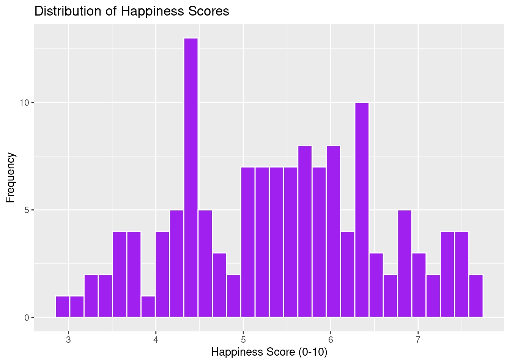

The histogram shows us the distribution of happiness scores. More than 12 countries have a score of around 4.4, and many countries have scores between 5 and 6.5. A couple of countries have scores close to 3, while a few have scores of 8 or above. (Note: Happiness score is the national average response to the question of life evaluations asking "Please imagine a ladder, with steps numbered from 0 at the bottom to 10 at the top. The top of the ladder represents the best possible life for you and the bottom of the ladder represents the worst possible life for you. On which step of the ladder would you say you personally feel you stand at this time?" This measure is also referred to as Cantril life ladder.)


```r
# Scatterplot of happiness score VS GDP per capita
ggplot(data=countries_with_happy, aes(x=GDP, y=Happiness_score)) + 
  geom_point() +
  ggtitle("GDP VS Happiness Score") + 
  ylab("Happiness Score (0-10)") + 
  xlab("GDP per capita") 
```

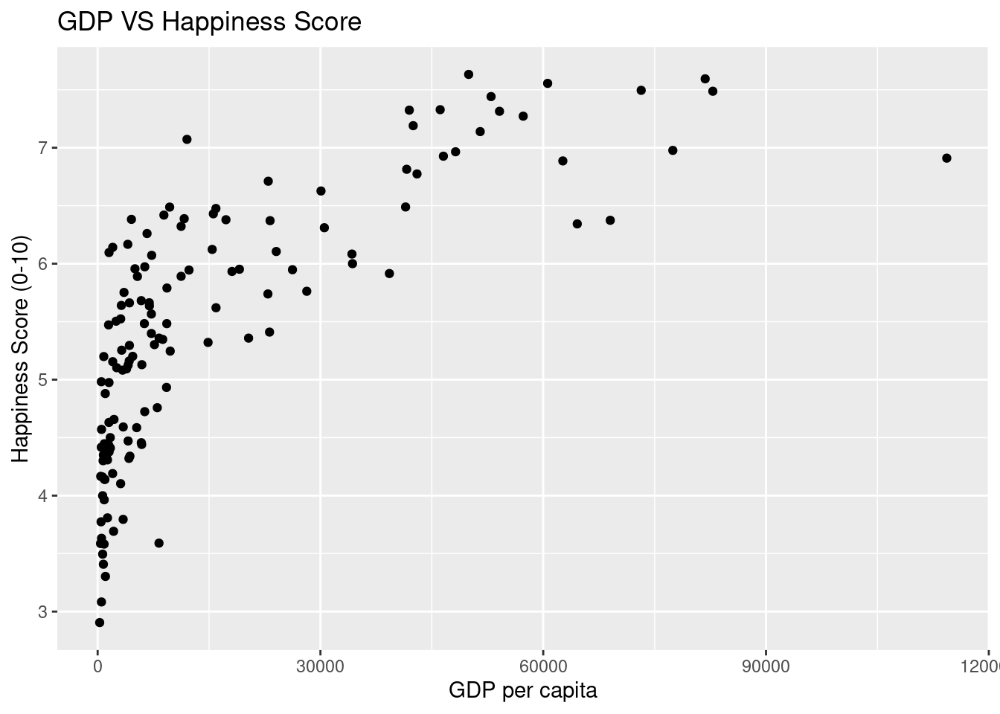

Overall, there is an upward trend, indicating that countries or regions with higher GDP tend to, on average, have higher happiness scores, and there seems to be some curvature here. There is a good amount of variability in happiness scores for countries with very low GDPs. For countries with GDPs close to 0 (i.e. in the low hundreds of US$), happiness scores range from below 3 to above 6. Note also that 4 countries with GDPs of above \$60,000 have happiness scores below 7.

For the data points that have GDP per capita very close to 0, this implies either an extremely low or non-exist GDP (total economic output) or a very large population relative to the economic output. Burundi has a GDP per capita of $275.


```r
library(corrplot)
```

```
## corrplot 0.92 loaded
```

```r
# Correlation plot for numerical variables in the dataset:
Corr <- cor(select_if(countries_with_happy, is.numeric), use="complete.obs")
corrplot(Corr)
```

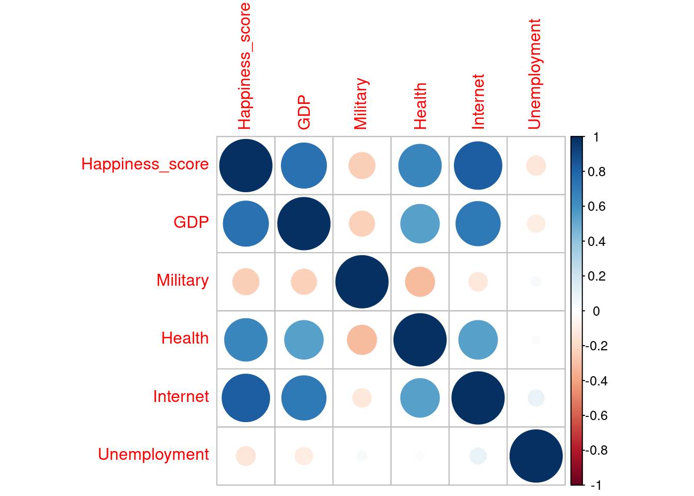

Happiness score seems to have a fairly high positive correlation with GDP which is consistent with what I found in my scatterplot above. Happiness score also has fairly high positive correlations with percentage of government expenditures directed towards healthcare and percentage of the population with access to the internet. Happiness score has a weak negative correlation with unemployment, but it also has a weak negative correlation with percentage of government expenditures directed toward the military, which is interesting and might be something worth looking into.


```r
# Sorting the Data by GDP and Selecting the 10 Lowest GDPs
lowest_gdp_data <- countries_with_happy[order(countries_with_happy$GDP), ][1:10,]

# Creating a Horizontal Bar Chart of Happiness Scores for the 10 Countries with the Lowest GDPs
ggplot(lowest_gdp_data, aes(x = Happiness_score, y = reorder(Country_or_region, GDP), fill = GDP)) +
  scale_fill_gradient(low = "lightblue", high = "dodgerblue") + 
  geom_bar(stat = "identity") +
  labs(title = "Happiness Scores for the 10 Countries/Regions with the Lowest GDPs", x = "Happiness Score (0-10)", y = "Country or Region") +
  xlim(0,10) + # setting scale for x axis
  theme_minimal() +
  theme(axis.text = element_text(size = 10)) +
  geom_label(mapping = aes(label = Happiness_score))
```

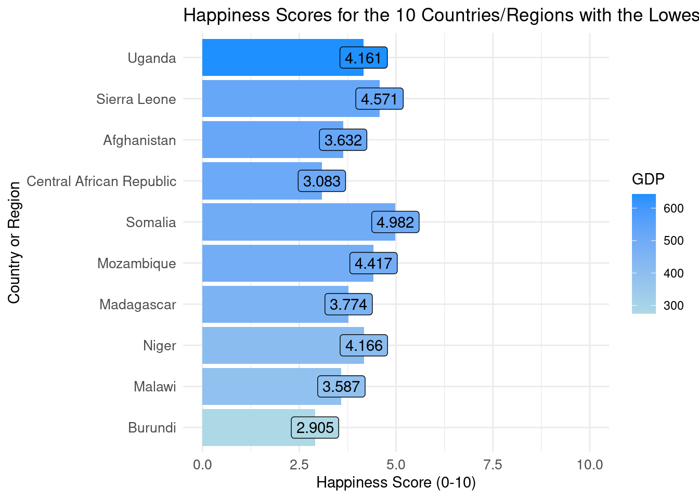


```r
# Sorting the Data by GDP and Selecting the 10 Highest GDPs
highest_gdp_data <- countries_with_happy[order(countries_with_happy$GDP, decreasing = TRUE), ][1:10,]

# Creating a Horizontal Bar Chart of Happiness Scores for the 10 Countries with the Lowest GDPs
ggplot(highest_gdp_data, aes(x = Happiness_score, y = reorder(Country_or_region, GDP), fill = GDP)) +
  scale_fill_gradient(low = "lightblue", high = "dodgerblue") + 
  geom_bar(stat = "identity") +
  labs(title = "Happiness Scores for the 10 Countries/Regions with the Highest GDPs", x = "Happiness Score (0-10)", y = "Country or Region") +
  xlim(0,10) + # setting scale for x axis
  theme_minimal() +
  theme(axis.text = element_text(size = 10)) +
  geom_label(mapping = aes(label = Happiness_score))
```

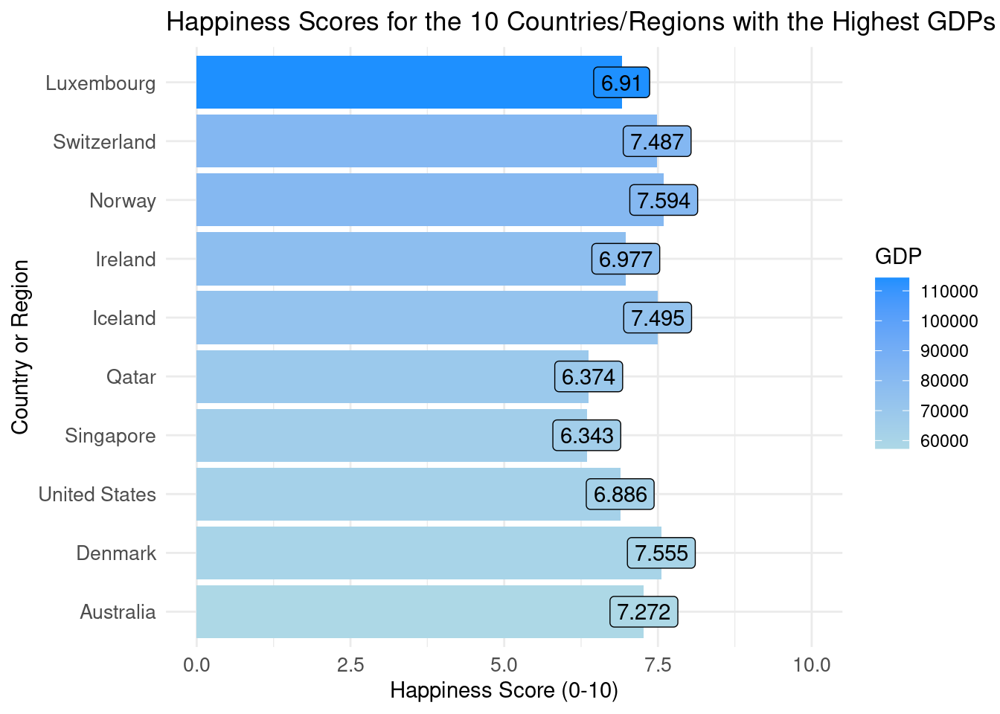

For the countries or regions with the 10 lowest GDPs in our dataset, happiness scores range from 2.905 to 4.982. Burundi, which has the lowest GDP of all countries and regions in our dataset, has the lowest happiness score of these 10 places. For the countries or regions with the 10 highest GDPs in our dataset, happiness scores range from 6.343 to 7.594. It is interesting that the country with the highest GDP has a lower happiness score than 6 of the countries or regions here.


```r
# Scatterplot of happiness score VS military
ggplot(data=countries_with_happy, aes(x=Military, y=Happiness_score)) + 
  geom_point() +
  ggtitle("% Gov Expenditures Directed Toward Military VS Happiness Score") + 
  ylab("Happiness Score (0-10)") + 
  xlab("% Gov Expenditures Directed Toward Military") +
  geom_smooth(method = "lm", se = FALSE)
```

```
## `geom_smooth()` using formula = 'y ~ x'
```

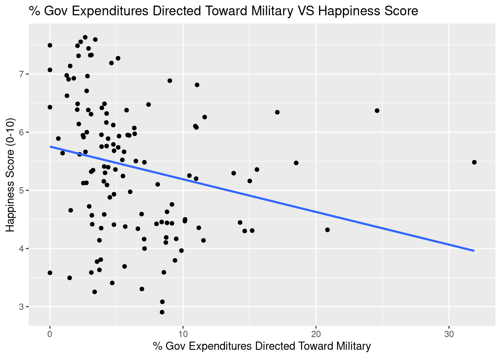

There seems to be a weak, negative linear relationship between percentage of government expenditures directed toward the military and happiness score, which is interesting. With that being said, there is a lot of variability in happiness scores among countries with lower percentages of government expenditures directed toward the military (i.e. less than 10%), with some countries having scores below 3.5 and others having scores above 7.5.


```r
# Scatterplot of happiness score VS unemployment
ggplot(data=countries_with_happy, aes(x=Unemployment, y=Happiness_score)) + 
  geom_point() +
  ggtitle("Unemployment VS Happiness Score") + 
  ylab("Happiness Score (0-10)") + 
  xlab("% Labor Force Unemployed") +
  geom_smooth(method = "lm", se = FALSE)
```

```
## `geom_smooth()` using formula = 'y ~ x'
```

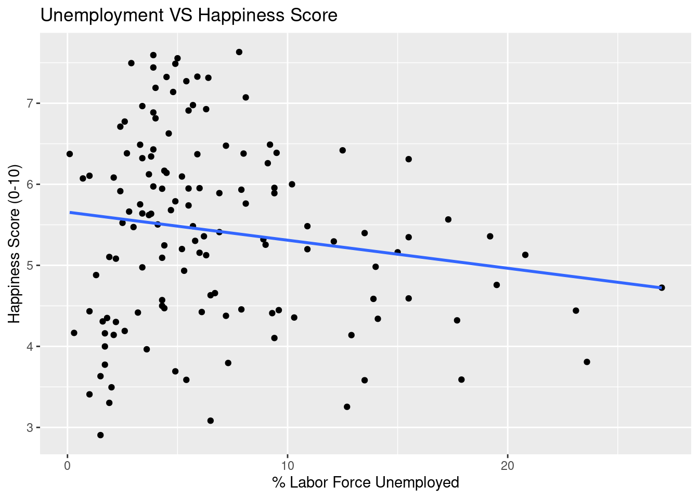

There also seems to be a weak, negative linear relationship between percent of the labor force unemployed and happiness score. It is interesting that there is more variability in happiness scores among countries with a smaller percentage of the labor force unemployed.

------------------------------------------------------------------------------------------------------------------------------------------------------------------

# Week 2 Work:


```r
ggplot(data=countries_with_happy, aes(x = GDP, y = Happiness_score)) + 
  geom_point() +
  stat_smooth(method="lm", se=FALSE) + 
  ggtitle("Happines Score VS GDP") + 
  xlab("GDP") + ylab("Happiness Score (0-10)") 
```

```
## `geom_smooth()` using formula = 'y ~ x'
```

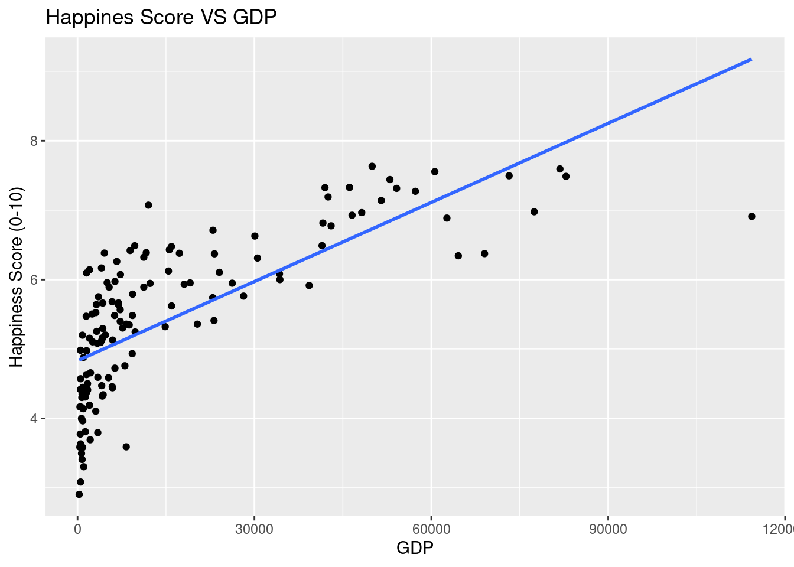

```r
ggplot(data=countries_with_happy, aes(x = Internet, y = Happiness_score)) + geom_point() +
  stat_smooth(method="lm", se=FALSE) + 
  ggtitle("Happiness Score VS % Population with Access to Internet") + 
  xlab("% Population with Access to Internet") + ylab("Happiness Score (0-10)") 
```

```
## `geom_smooth()` using formula = 'y ~ x'
```

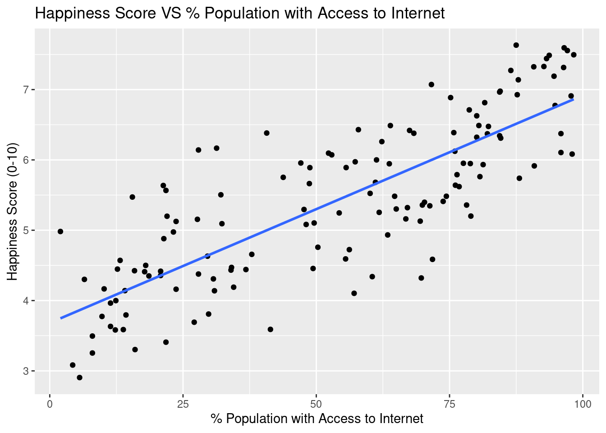

Fitting a simple linear regression model with GDP as the only explanatory variable to the data, we obtain the following:


```r
Happy_M1 <- lm(data=countries_with_happy, Happiness_score~GDP)
summary(Happy_M1)
```

```
## 
## Call:
## lm(formula = Happiness_score ~ GDP, data = countries_with_happy)
## 
## Residuals:
##     Min      1Q  Median      3Q     Max 
## -2.2662 -0.5119  0.1208  0.5792  1.7830 
## 
## Coefficients:
##              Estimate Std. Error t value Pr(>|t|)    
## (Intercept) 4.832e+00  8.220e-02   58.78   <2e-16 ***
## GDP         3.799e-05  3.043e-06   12.49   <2e-16 ***
## ---
## Signif. codes:  0 '***' 0.001 '**' 0.01 '*' 0.05 '.' 0.1 ' ' 1
## 
## Residual standard error: 0.7729 on 134 degrees of freedom
##   (1 observation deleted due to missingness)
## Multiple R-squared:  0.5378,	Adjusted R-squared:  0.5343 
## F-statistic: 155.9 on 1 and 134 DF,  p-value: < 2.2e-16
```

On average, happiness score is expected to increase by about 0.00003799 for each additional $1 in GDP per capita. The low p-value suggests a relationship like this is unlikely to occur by chance. 53.78% of the total variation in happiness score is explained by GDP. 


```r
Corr
```

```
##                 Happiness_score        GDP    Military      Health    Internet
## Happiness_score       1.0000000  0.7426183 -0.24867977  0.65834605  0.82361037
## GDP                   0.7426183  1.0000000 -0.23066266  0.54231216  0.71338656
## Military             -0.2486798 -0.2306627  1.00000000 -0.31084773 -0.12652959
## Health                0.6583461  0.5423122 -0.31084773  1.00000000  0.54441759
## Internet              0.8236104  0.7133866 -0.12652959  0.54441759  1.00000000
## Unemployment         -0.1319573 -0.1096437  0.03801901  0.02842927  0.09473441
##                 Unemployment
## Happiness_score  -0.13195732
## GDP              -0.10964367
## Military          0.03801901
## Health            0.02842927
## Internet          0.09473441
## Unemployment      1.00000000
```

GDP and Internet have a correlation of around 0.713, so we should check to see if SE on GDP increases significantly after adding Internet to our model. 


```r
Happy_GDPInternet <- lm(data=countries_with_happy, Happiness_score~GDP+Internet)
summary(Happy_GDPInternet)
```

```
## 
## Call:
## lm(formula = Happiness_score ~ GDP + Internet, data = countries_with_happy)
## 
## Residuals:
##      Min       1Q   Median       3Q      Max 
## -1.42735 -0.47187 -0.00772  0.40178  1.53590 
## 
## Coefficients:
##              Estimate Std. Error t value Pr(>|t|)    
## (Intercept) 3.934e+00  1.264e-01  31.124  < 2e-16 ***
## GDP         1.666e-05  3.575e-06   4.659 7.67e-06 ***
## Internet    2.285e-02  2.744e-03   8.326 9.27e-14 ***
## ---
## Signif. codes:  0 '***' 0.001 '**' 0.01 '*' 0.05 '.' 0.1 ' ' 1
## 
## Residual standard error: 0.6288 on 132 degrees of freedom
##   (2 observations deleted due to missingness)
## Multiple R-squared:  0.6985,	Adjusted R-squared:  0.694 
## F-statistic: 152.9 on 2 and 132 DF,  p-value: < 2.2e-16
```

The SE on GDP increased from 3.043e-06 to 3.575e-06, which is not that much. Thus, it should be fine to include both GDP and Internet in the model. We can interpret this model as follows: on average, happiness score is expected to increase by about 0.00001666 for each additional \$1 in GDP per capital, assuming the percentage of the population with access to the internet remains constant. On average, happiness score is expected to increase by about 0.02285 for each additional percentage of the population with access to the internet, assuming GDP remains constant. 69.85% of the total variation in happiness score is explained by GDP and Internet.

Let us investigate whether there is an interaction between GDP and Internet via scatterplot:


```r
# Scatterplot of happiness score VS GDP per capita with color = Internet
ggplot(data=countries_with_happy, aes(x=GDP, y=Happiness_score, color = Internet)) + 
  geom_point() +
  ggtitle("GDP VS Happiness Score") + 
  ylab("Happiness Score (0-10)") + 
  xlab("GDP per capita") 
```

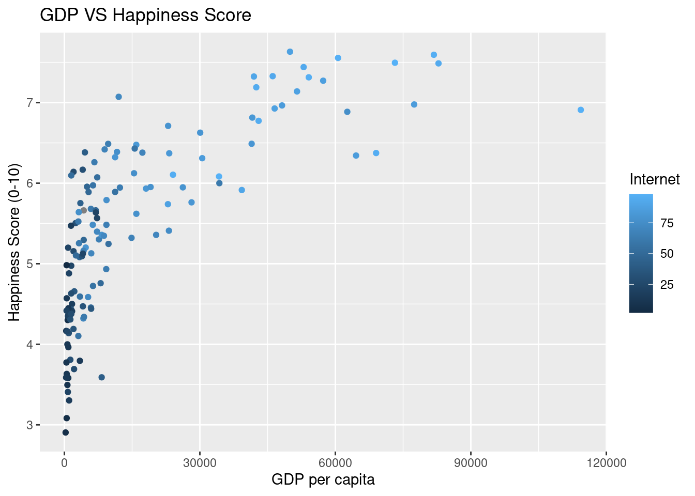

In general, it looks like countries with low percentages of the population with access to the internet have the smallest GDP per capita, which makes sense. There is no super clear difference in the rate of change in happiness score with respect to GDP for different percentages (i.e. 50% vs 75%) of the population with access to internet.

I also created a categorical variable for Internet to further investigate the possibility of an interaction between GDP and Internet:


```r
# Creating a categorical variable for Internet:
countries_with_happy$Internet_Categorical <- cut(countries_with_happy$Internet, breaks = c(0, 25, 50, 75, 100), labels = c("0-25", "25-50", "50-75", "75-100"))

# New ggplot
ggplot(data = countries_with_happy, aes(x = GDP, y = Happiness_score, color = Internet_Categorical)) + 
  geom_point() +
  geom_smooth(method = "lm", se = FALSE, aes(group = Internet_Categorical)) +
  ggtitle("GDP VS Happiness Score") + 
  ylab("Happiness Score (0-10)") + 
  xlab("GDP per capita")
```

```
## `geom_smooth()` using formula = 'y ~ x'
```

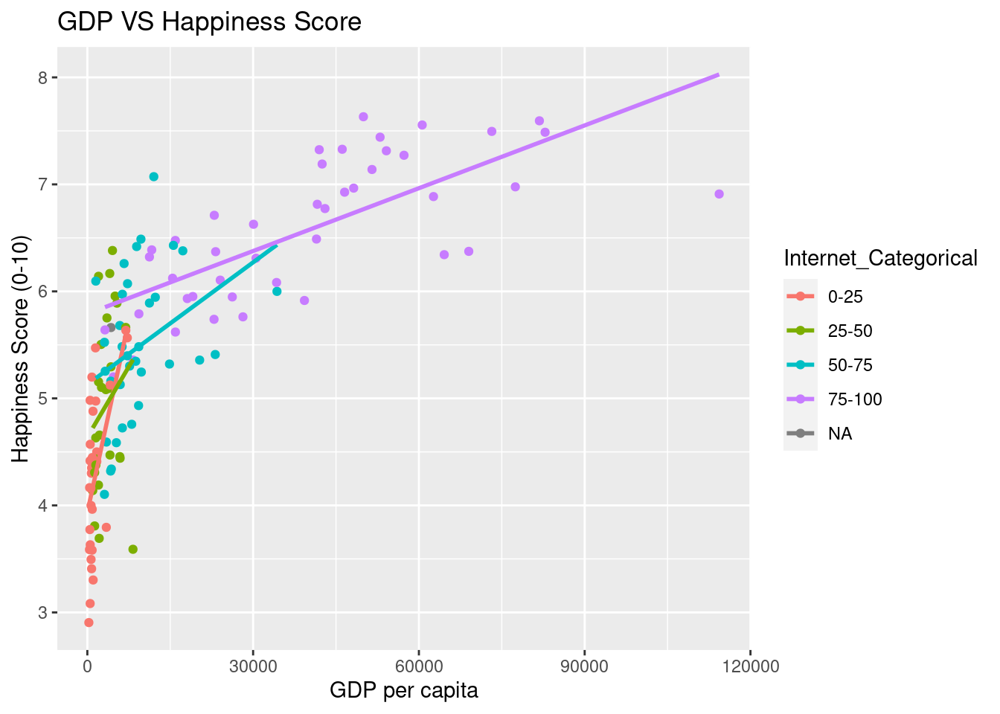

Again, it just looks to me like the countries with lower percentages of the population with access to the internet have lower GDPs, but it does not necessarily look like there is a need for an interaction term (?). For now, I will opt not to include an interaction between GDP and Internet, which will ultimately complicate model interpretation as well.

We can add Health to the model without interaction. 


```r
Happy_M3 <- lm(data=countries_with_happy, Happiness_score~GDP+Internet+Health)
summary(Happy_M3)
```

```
## 
## Call:
## lm(formula = Happiness_score ~ GDP + Internet + Health, data = countries_with_happy)
## 
## Residuals:
##      Min       1Q   Median       3Q      Max 
## -1.38610 -0.39226  0.01656  0.36749  1.40711 
## 
## Coefficients:
##              Estimate Std. Error t value Pr(>|t|)    
## (Intercept) 3.617e+00  1.375e-01  26.303  < 2e-16 ***
## GDP         1.317e-05  3.437e-06   3.831 0.000198 ***
## Internet    2.047e-02  2.710e-03   7.554 6.63e-12 ***
## Health      4.399e-02  1.051e-02   4.186 5.20e-05 ***
## ---
## Signif. codes:  0 '***' 0.001 '**' 0.01 '*' 0.05 '.' 0.1 ' ' 1
## 
## Residual standard error: 0.5889 on 130 degrees of freedom
##   (3 observations deleted due to missingness)
## Multiple R-squared:  0.7393,	Adjusted R-squared:  0.7332 
## F-statistic: 122.9 on 3 and 130 DF,  p-value: < 2.2e-16
```

On average, happiness score is expected to increase by about 0.00001317 for each additional $1 in GDP per capita, assuming the percentage of government expenditures directed towards healthcare and percentage of the population with access to the internet remains constant. The low p-value suggests a relationship like this is unlikely to occur by chance. On average, happiness score is expected to increase by 0.02047 for every 1% increase in population with access to the internet, assuming GDP and percentage of government expenditures directed toward healthcare remain constant. On average, happiness score is expected to increase by 0.04399 for every 1% increase in government expenditures directed towards healthcare, assuming GDP and percentage of the population with access to the internet remain constant. 73.93% of the total variation in happiness score is explained by GDP, Internet, and Health.


Let's try adding in military and unemployment as well:


```r
Happy_M4 <- lm(data=countries_with_happy, Happiness_score~GDP+Internet+Health+Military+Unemployment)
summary(Happy_M4)
```

```
## 
## Call:
## lm(formula = Happiness_score ~ GDP + Internet + Health + Military + 
##     Unemployment, data = countries_with_happy)
## 
## Residuals:
##     Min      1Q  Median      3Q     Max 
## -1.3590 -0.2884  0.0235  0.3359  1.5029 
## 
## Coefficients:
##                Estimate Std. Error t value Pr(>|t|)    
## (Intercept)   3.762e+00  1.593e-01  23.615  < 2e-16 ***
## GDP           8.631e-06  3.353e-06   2.574   0.0113 *  
## Internet      2.422e-02  2.578e-03   9.393 4.51e-16 ***
## Health        4.701e-02  1.031e-02   4.558 1.24e-05 ***
## Military     -1.321e-02  1.019e-02  -1.297   0.1971    
## Unemployment -3.917e-02  9.530e-03  -4.110 7.24e-05 ***
## ---
## Signif. codes:  0 '***' 0.001 '**' 0.01 '*' 0.05 '.' 0.1 ' ' 1
## 
## Residual standard error: 0.5318 on 121 degrees of freedom
##   (10 observations deleted due to missingness)
## Multiple R-squared:  0.7982,	Adjusted R-squared:  0.7898 
## F-statistic: 95.71 on 5 and 121 DF,  p-value: < 2.2e-16
```

R^2 increased from 0.7393 to 0.7982. 

Now let's check our model assumptions:


```r
P1 <- ggplot(data=data.frame(Happy_M4$residuals), aes(y=Happy_M4$residuals, x=Happy_M4$fitted.values)) + geom_point() + ggtitle("Residual Plot") + xlab("Predicted Values") + ylab("Residuals")
P2 <- ggplot(data=data.frame(Happy_M4$residuals), aes(x=Happy_M4$residuals)) + geom_histogram() + ggtitle("Histogram of Residuals") + xlab("Residual")
P3 <- ggplot(data=data.frame(Happy_M4$residuals), aes(sample = scale(Happy_M4$residuals))) + stat_qq() + stat_qq_line() + xlab("Normal Quantiles") + ylab("Residual Quantiles") + ggtitle("QQ Plot")
grid.arrange(P1, P2, P3, ncol=3)
```

```
## `stat_bin()` using `bins = 30`. Pick better value with `binwidth`.
```

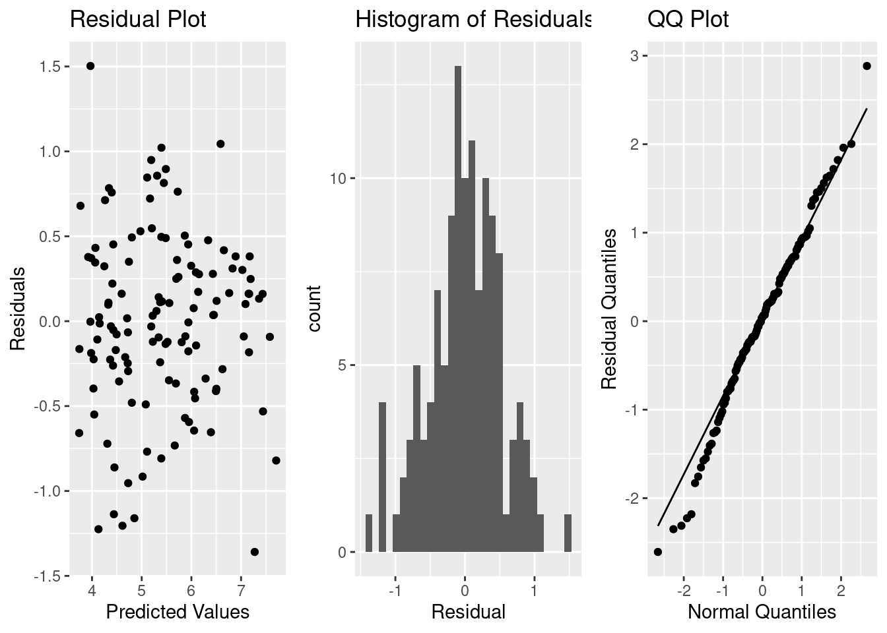

We do not see any curvature or funnel shapes in the residual plot, so the linearity and constant variance assumptions seem valid. There is also a bit of left-skewness in our QQ plot, but it doesn’t seem too significant. This may indicate a bit of concern about the normality assumption, although again I don’t think we need to worry too much about it.

With regards to the independence assumption, we must think about whether there were factors in the data collection that would cause some observations to be more highly correlated than others. There's a possibility that countries or regions in the same area / continent are more highly correlated. I might need to think about a model that can account for this -- perhaps I would need a model that accounts for correlation using spatial structure?

In models with multiple explanatory variables, it is helpful to also plot our residuals against the explanatory variables to see whether the model is properly accounting for relationships involving each variable. If we see nonlinear trends, we should consider adding a nonlinear function of that explanatory variable.


```r
P4 <- ggplot(data=data.frame(Happy_M4$residuals), aes(y=Happy_M4$residuals, x=Happy_M4$model$GDP)) + geom_point() + ggtitle("Residual by Predictor Plot") + xlab("GDP per capita") + ylab("Residuals")
P5 <- ggplot(data=data.frame(Happy_M4$residuals), aes(y=Happy_M4$residuals, x=Happy_M4$model$Internet)) + geom_point() + ggtitle("Residual by Predictor Plot") + xlab("% Pop With Access to Internet") + ylab("Residuals")
P6 <- ggplot(data=data.frame(Happy_M4$residuals), aes(y=Happy_M4$residuals, x=Happy_M4$model$Health)) + geom_point() + ggtitle("Residual by Predictor Plot") + xlab("% Gov Exp Dir Towards Healthcare") + ylab("Residuals")
P7 <- ggplot(data=data.frame(Happy_M4$residuals), aes(y=Happy_M4$residuals, x=Happy_M4$model$Military)) + geom_point() + ggtitle("Residual by Predictor Plot") + xlab("% Gov Exp Dir Towards Military") + ylab("Residuals")
P8 <- ggplot(data=data.frame(Happy_M4$residuals), aes(y=Happy_M4$residuals, x=Happy_M4$model$Unemployment)) + geom_point() + ggtitle("Residual by Predictor Plot") + xlab("% Labor Force Unemployed") + ylab("Residuals")
grid.arrange(P4, P5, P6, P7, P8, ncol=3)
```

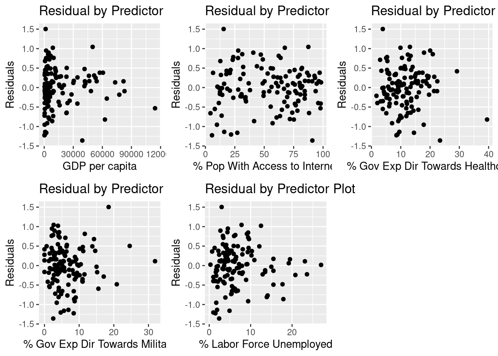

There is some concern about the constant variance assumption, particularly in the plots of residuals against GDP, Military, and Unemployed. It is worth noting that this violation of the constant variance assumption could potentially lead to wider intervals, but the predictions should still be reliable (? I can think more about this). The linearity assumption looks good here; there is not really any curvature in our residual plots. 
